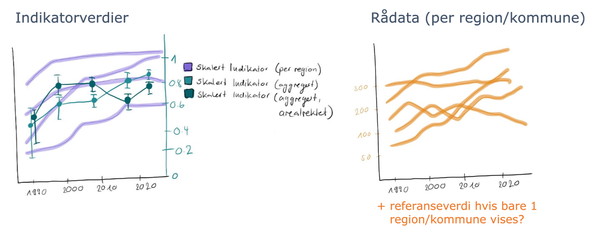

# Time series {#cross}

```{r setup_timeseries, echo=FALSE, message=FALSE, warning=FALSE}
source("R/colorPalettes.R")
source("R/ggplotTheme.R")
```

This chapter presents prototypes for upgraded representations of time-series information, both raw data and scaled indicator values. 

We had conceptually outlined two major ideas here (Figure \@ref(fig:NItsSketch)):

1) Graphs with toggle options allowing to display data and indicator values with different levels of aggregation, and for the different areas they are reported for in the database
2) Side-by-side presentation of scaled indicator data and raw data

```{r NItsSketch, out.width = "100%", echo = FALSE, fig.cap = "Early sketch of ideas for improving / adding additional information to time-series plots."}

```

Time was not sufficient to implement all of these aspects in great detail and some are still missing in the presentation below (e.g. the overlay of averaged indicator values over area-specific indicator values).

## Raw data

```{r raw data, echo=TRUE, message=FALSE, warning=FALSE}
library(plotly)
## TODO change to correct data source
passerinesImport <- readRDS("data/passerinesImport.rds")

dat=passerinesImport$indicatorObservations$indicatorValues 

dat$yearName=as.numeric(dat$yearName) # convert character vector to numeric years
sum_dat=dat %>% 
  group_by(ICunitName, yearName) %>% 
  summarise(mnExpected=mean(expectedValue, na.rm=TRUE),
            mnUpper=mean(upperQuantile, na.rm=TRUE),
            mnLower=mean(lowerQuantile, na.rm=TRUE)) # summerise the data to mean values

p=sum_dat %>% 
  ggplot(aes(as.numeric(yearName), mnExpected, col=ICunitName))+
  geom_line()+
  geom_pointrange(aes(x=as.numeric(yearName), y=mnExpected, ymin=mnLower, ymax=mnUpper))+
  geom_point(data=dat, aes(as.numeric(yearName), expectedValue, alpha=0.2))+
  labs(x="year", y="Expected value")+
  theme_NIseries()
p2=ggplotly(p)
p2 %>% layout(
  updatemenus = list(
    list(
      type = "list",
      label = 'Category',
      buttons = list(
        list(method = "restyle",
             args = list('visible', c(TRUE, FALSE, FALSE)),
             label = "Nord-Norge"),
        list(method = "restyle",
             args = list('visible', c(FALSE, TRUE, FALSE)),
             label = "Norge"),
        list(method = "restyle",
             args = list('visible', c(FALSE, FALSE, TRUE)),
             label = "Sør-Norge")
      )
    )
  )
) # Add drop down menus for the data

  
```

## Scaled data


```{r scaled data, echo=TRUE, message=FALSE, warning=FALSE}
Elg_assemebled<- readRDS("data/Elg_assemebled.rds")
mycols=c("ICunitName" ,"yearName", "expectedValue","lowerQuantile", "upperQuantile")

data_list<-lapply(Elg_assemebled$indicatorValues, function(x) x%>% select(mycols))

dat<-bind_rows(data_list, .id = "column_label")

# plot
sum_dat=dat %>% 
  group_by(ICunitName, yearName) %>% 
  summarise(mnExpected=mean(expectedValue, na.rm=TRUE),
            mnUpper=mean(upperQuantile, na.rm=TRUE),
            mnLower=mean(lowerQuantile, na.rm=TRUE)) # summerise the data to mean values
source("R/ggplotTheme.R")
p=sum_dat %>% 
  ggplot(aes(as.numeric(yearName), mnExpected, col=ICunitName))+
  geom_line()+
  geom_pointrange(aes(x=as.numeric(yearName), y=mnExpected, ymin=mnLower, ymax=mnUpper))+
  geom_point(data=dat, aes(as.numeric(yearName), expectedValue, alpha=0.2))+
  labs(x="year", y="Expected value")+
  theme_NIseries()
p2=ggplotly(p)
p2 %>% layout(
  updatemenus = list(
    list(
      type = "list",
      label = 'Category',
      buttons = list(
        list(method = "restyle",
             args = list('visible', c(TRUE, FALSE, FALSE, FALSE, FALSE, FALSE, FALSE, FALSE, FALSE, FALSE, FALSE, FALSE, FALSE, FALSE, FALSE, FALSE, FALSE, FALSE)),
             label = unique(dat$ICunitName)[2]),
        list(method = "restyle",
             args = list('visible', c(FALSE, TRUE, FALSE, FALSE, FALSE, FALSE, FALSE, FALSE, FALSE, FALSE, FALSE, FALSE, FALSE, FALSE, FALSE, FALSE, FALSE, FALSE)),
             label = unique(dat$ICunitName)[8]),
        list(method = "restyle",
             args = list('visible', c(FALSE, FALSE,TRUE, FALSE, FALSE, FALSE, FALSE, FALSE, FALSE, FALSE, FALSE, FALSE, FALSE, FALSE, FALSE, FALSE, FALSE, FALSE)),
             label = unique(dat$ICunitName)[5]),
        list(method = "restyle",
             args = list('visible', c( FALSE, FALSE, FALSE,TRUE, FALSE, FALSE, FALSE, FALSE, FALSE, FALSE, FALSE, FALSE, FALSE, FALSE, FALSE, FALSE, FALSE, FALSE)),
             label = unique(dat$ICunitName)[18]),
        list(method = "restyle",
             args = list('visible', c(FALSE, FALSE, FALSE,FALSE, TRUE, FALSE, FALSE, FALSE, FALSE, FALSE, FALSE, FALSE, FALSE, FALSE, FALSE, FALSE, FALSE, FALSE)),
             label = unique(dat$ICunitName)[3]),
        list(method = "restyle",
             args = list('visible', c( FALSE, FALSE, FALSE,FALSE, FALSE, TRUE, FALSE, FALSE, FALSE, FALSE, FALSE, FALSE, FALSE, FALSE, FALSE, FALSE, FALSE, FALSE)),
             label = unique(dat$ICunitName)[11]),
        list(method = "restyle",
             args = list('visible', c( FALSE, FALSE, FALSE,FALSE, FALSE, FALSE, TRUE, FALSE, FALSE, FALSE, FALSE, FALSE, FALSE, FALSE, FALSE, FALSE, FALSE, FALSE)),
             label = unique(dat$ICunitName)[13]),
        list(method = "restyle",
             args = list('visible', c( FALSE, FALSE, FALSE,FALSE, FALSE, FALSE, FALSE, TRUE, FALSE, FALSE, FALSE, FALSE, FALSE, FALSE, FALSE, FALSE, FALSE, FALSE)),
             label = unique(dat$ICunitName)[15]),
        list(method = "restyle",
             args = list('visible', c( FALSE, FALSE, FALSE,FALSE, FALSE, FALSE, FALSE, FALSE, TRUE, FALSE, FALSE, FALSE, FALSE, FALSE, FALSE, FALSE, FALSE, FALSE)),
             label = unique(dat$ICunitName)[16]),
        list(method = "restyle",
             args = list('visible', c( FALSE, FALSE, FALSE,FALSE, FALSE, FALSE, FALSE, FALSE, FALSE, TRUE, FALSE, FALSE, FALSE, FALSE, FALSE, FALSE, FALSE, FALSE)),
             label = unique(dat$ICunitName)[4]),
        list(method = "restyle",
             args = list('visible', c( FALSE, FALSE, FALSE,FALSE, FALSE, FALSE, FALSE, FALSE, FALSE, FALSE, TRUE, FALSE, FALSE, FALSE, FALSE, FALSE, FALSE, FALSE)),
             label = unique(dat$ICunitName)[10]),
        list(method = "restyle",
             args = list('visible', c( FALSE, FALSE, FALSE,FALSE, FALSE, FALSE, FALSE, FALSE, FALSE, FALSE, FALSE, TRUE, FALSE, FALSE, FALSE, FALSE, FALSE, FALSE)),
             label = unique(dat$ICunitName)[12]),
        list(method = "restyle",
             args = list('visible', c( FALSE, FALSE, FALSE,FALSE, FALSE, FALSE, FALSE, FALSE, FALSE, FALSE, FALSE, FALSE, TRUE, FALSE, FALSE, FALSE, FALSE, FALSE)),
             label = unique(dat$ICunitName)[14]),
        list(method = "restyle",
             args = list('visible', c( FALSE, FALSE, FALSE,FALSE, FALSE, FALSE, FALSE, FALSE, FALSE, FALSE, FALSE, FALSE, FALSE, TRUE, FALSE, FALSE, FALSE, FALSE)),
             label = unique(dat$ICunitName)[7]),
        list(method = "restyle",
             args = list('visible', c( FALSE, FALSE, FALSE,FALSE, FALSE, FALSE, FALSE, FALSE, FALSE, FALSE, FALSE, FALSE, FALSE, FALSE, TRUE, FALSE, FALSE, FALSE)),
             label = unique(dat$ICunitName)[17]),
        list(method = "restyle",
             args = list('visible', c( FALSE, FALSE, FALSE,FALSE, FALSE, FALSE, FALSE, FALSE, FALSE, FALSE, FALSE, FALSE, FALSE, FALSE, FALSE, TRUE, FALSE, FALSE)),
             label = unique(dat$ICunitName)[9]),
        list(method = "restyle",
             args = list('visible', c( FALSE, FALSE, FALSE,FALSE, FALSE, FALSE, FALSE, FALSE, FALSE, FALSE, FALSE, FALSE, FALSE, FALSE, FALSE, FALSE, TRUE, FALSE)),
             label = unique(dat$ICunitName)[6]),
        list(method = "restyle",
             args = list('visible', c( FALSE, FALSE, FALSE,FALSE, FALSE, FALSE, FALSE, FALSE, FALSE, FALSE, FALSE, FALSE, FALSE, FALSE, FALSE, FALSE, FALSE, TRUE)),
             label = unique(dat$ICunitName)[1])
      )
    )
  )
) # Add drop down menus for the data


```

