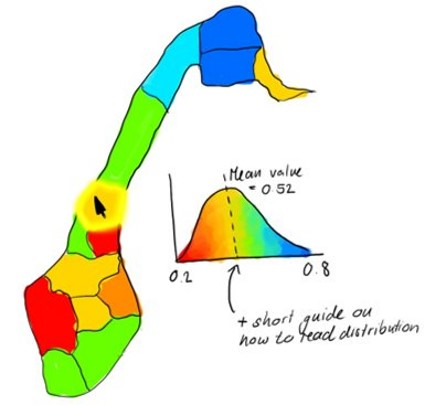

# Maps

```{r setup_maps, echo=FALSE, message=FALSE, warning=FALSE}
source("R/colorPalettes.R")
source("R/ggplotTheme.R")
library(tmap)
```

This chapter presents a prototype for a map representation of both average indicator values and of uncertainty therein. Most of it is focused on a side-by-side presentation of two zoomable maps: one for average values and one for the coefficient of variation (= a measure of uncertainty). 

At the end, we also mention some additional ideas that we did not implement (fully) yet but may be worth trying out. 


## Raw data
We have not written code yet for making raw data maps, but this would entail just small changes to the proposed solutions for maps of scaled data (below). 

## Scaled data

### Jerv


#### Prepare NI data

The jerv (wolverine) data was downloaded using the `R/singleIndicator.R` script and the importDatasetApi() function, and subsequently the assembleNiObject() function, so now we can simply import it.
```{r, include=F, eval=FALSE}
# RETRIEVE DATA FROM DATABASE #
#-----------------------------#'
indicator <- c("Dikesoldogg")
indicator <- c("Jerv")

myUsername <- "anders.kolstad@nina.no"
myPassword <- ""

indicatorImport <- importDatasetApi(username = myUsername,
                                    password = myPassword,
                                    eco = NULL,
                                    indic = indicator,
                                    year = c("1990","2000","2010","2014","2019"),
                                    norwegian = TRUE,
                                    refYearCode = 0)
#getwd()
#saveRDS(indicatorImport, "data/jerv.rds")


# ASSEMBLE 
# Spesify all of Norway incl the five regions, som NIunits:
myNIunits <- c(allArea = T, parts = T, counties = F)

# Include all BSunits (kommuner):
myPartOfTotal <- 0

assemeble <- NIcalc::assembleNiObject(
  inputData = indicatorImport,
  predefNIunits = myNIunits, 
  partOfTotal = myPartOfTotal, 
  indexType = "thematic",
  part = "ecosystem",
  total = "terrestrial")  


#saveRDS(assemeble, "data/jerv_assemble.rds")    
```


```{r}
jerv <- readRDS("data/Jerv_assemebled.rds")
```


This data file contains the raw data in the form of expected values for each BSunits (municipalities). But we actually want to keep the original geometries of the eight "rovviltregioner", and so we need to focus in the ICunits instead.
```{r, fig.cap="Estimated number of\nwolverine in 2019, exported from the NI database."}
par(mar=c(9,5,1,1))
barplot(jerv$indicatorValues$`2019`$expectedValue,
        names.arg = jerv$indicatorValues$`2019`$ICunitName, 
        las=2,
        ylab = "Estimated number of\nwolverine in 2019")
```

The data also contains upper and lower quantiles, but we can also get the full probability distribution and sample from it to get standard deviations, but also as probability functions that we can sample from:
```{r, fig.cap="Probability distribuition for the number of wolverine, resamlped using data from the NI database and R function in the NIcalc-package."}
# bruker tradOb siden custumDist er NA. Dette er ikke en generisk løsning. 
obstype <- rep("tradObs", nrow(jerv$indicatorValues$'2019'))

#myYears <- as.character(c(1990,2000,2010,2014,2019))
myYears <- as.character(c(2019))

for(i in 1:length(myYears)){
# print(i)

myMat <- NIcalc::sampleObsMat(
  ICunitId           = jerv$indicatorValues[[i]]$ICunitId, 
  value              = jerv$indicatorValues[[i]]$expectedValue,
  distrib            = jerv$indicatorValues[[i]]$distributionFamilyName,
  mu                 = jerv$indicatorValues[[i]]$distParameter1,
  sig                = jerv$indicatorValues[[i]]$distParameter2,
  customDistribution = jerv$indicatorValues[[i]]$customDistribution,
          obsType = obstype,
          nsim = 1000
          
)
assign(paste0("myMat", myYears[i]), myMat)
}

par(mfrow = c(1,2))
hist(myMat2019[1,], main = "Rovviltregion 1", xlab = "")
hist(myMat2019[8,], main = "Rovviltregion 8", xlab = "")

```

For some reason the expected values are far from the mean of these distributions. Anders did this exercise [once before](https://ninanor.github.io/IBECA/jerv.html), and did not get this problem then. We think the difference is that we use eco = NULL this time, in the `importDatasetApi()`, and this cause the output to somehow split into forest and alpine ecosystems. We will ignore this here for this example.

We can also get the reference values in the same way, and then divide one by the other to get scaled values
```{r, fig.cap="Example distribution of scaled indicator values for wolverine."}
myMatr <- NIcalc::sampleObsMat(
            jerv$referenceValues$ICunitId, 
            jerv$referenceValues$expectedValue,
            jerv$referenceValues$distributionFamilyName,
            mu = jerv$referenceValues$distParameter1,
            sig = jerv$referenceValues$distParameter2,
            customDistribution = jerv$referenceValues$customDistribution,
            obsType = obstype,
            nsim =1000
        )

temp <- colSums(myMat2019)/colSums(myMatr)
hist(temp, xlab = "Scaled indicator value for wolverine",main="")
```

Then we will create a data frame with the mean indicator values and the SD.
```{r, fig.cap="Table showing the different parameters and summary statistics for the wolverine indicator."}
library(matrixStats)
jerv_tbl <- data.frame("raw2019" = round(rowMeans(myMat2019), 2),
                       "sd2019"  = round(matrixStats::rowSds(myMat2019), 2),
                       "ref"     = round(rowMeans(myMatr), 2))
jerv_tbl$scaled <- round(jerv_tbl$raw2019/jerv_tbl$ref, 2)
jerv_tbl$cv <- round(jerv_tbl$sd2019/jerv_tbl$raw2019, 2)
jerv_tbl$region <- jerv$indicatorValues$`2019`$ICunitName
DT::datatable(jerv_tbl)
```
This is a special case maybe, because the sd is often larger than the mean.

Note that we could use inbuilt NIcalc functions to get the indicator value, like we do below, but that will aggregate to regions, and we want to keep the original geometry.
```{r, fig.cap="The scaled indicator values for wolverine across Norway."}
jervComp <- NIcalc::calculateIndex(
  x       = jerv,
  nsim     = 1000,
  awBSunit = "terrestrialArea",
  fids     = F,    # should fidelities be ignored in 
                   # the calculation of Wi?
  tgroups  = F, # should grouping of indicators 
                   # into trophic and key indicator 
                   # groups be ignored
  keys     = "specialWeight", #"ignore",
)
plot(jervComp$wholeArea)
```


#### Get geometries

Then we can get the spatial geometries associated with the data. These are the so-called "rovviltregioner". There are eight of them. They are actually linked to the BS-units (municipalities), but we don't want to plot the outlines of the municipalities.
The geometries for the appropriate spatial units of each indicator can be downloaded in .json format via a previously created API for the nature index database: https://ninweb08.nina.no/NaturindeksAPI/index.html
To get the file for a specific indicator, one needs to enter the numerical indicator id under "/api/Indicator/\{id\}/Areas" and then click download. We then converted the .json file to shapefiles for use in R.  

```{r}
path <- "P:/41201612_naturindeks_2021_2023_database_og_innsynslosning/Pilot_Forbedring_Innsynsløsning/Shapefiles/Jerv"
```

```{r}
library(sf)
rov <- sf::read_sf(path)
rov <- sf::st_make_valid(rov)
rov <- rov[rov$area!="DEF jerv",]
```

Clip it against the outline of Norway to make it look more pretty
```{r}
path <- "data/outlineOfNorway_EPSG25833.shp"
nor <- sf::read_sf(path)
nor <- st_transform(nor, crs=st_crs(rov))
```

```{r}
rov <- st_intersection(rov, nor)
```


#### Link data and geometries
Here we copy the data from the table into the geo-file.
```{r}
rov$scaledIndicator <- jerv_tbl$scaled[match(rov$area, jerv_tbl$region)]
rov$cv <- jerv_tbl$cv[match(rov$area, jerv_tbl$region)]
rov$raw <- jerv_tbl$raw2019[match(rov$area, jerv_tbl$region)]

```


Then we can attempt to create some nice example maps where the indicator uncertainty is shown parallel to the scaled values.


```{r, fig.cap="Scaled indicator values for the indikcator wolverine (left) and uncertainty as coefficients of variation (right)."}
# colour palette with 10 colours
pal <- grDevices::colorRampPalette(NIviz_colours[["IndMap_cols"]])(10)

one <- tm_shape(rov)+
  tm_polygons(col="scaledIndicator", 
              border.col = "white",
              style = "cont",
              breaks = seq(0,1, length.out = 11),
              palette = pal)


two <- tm_shape(rov)+
  tm_polygons(col="cv", 
              border.col = "black")

#three <- tm_shape(rov)+
#  tm_polygons(col="raw", 
#              border.col = "white")


tmap_mode("view")

tmap_arrange(one, two, 
             sync=T,
             widths = c(.75, .25),
             heights = c(1, 0.5)
             )
```

## Additional ideas

### Gradient density plots for interactive maps

Another idea we pursued is to build on the current map setup (Figure \@ref(fig:NIMap)), but include a visualization of the uncertainty distribution in the pop-up window that appears in the top-right corner when hovering over a region in the map. This idea is sketched out below in Figure \@ref(fig:NImapSketch), and we've written code to visualize corresponding distributions using the same color palette as the map in \@ref(#densities). 

```{r NImapSketch, out.width = "60%", echo = FALSE, fig.cap = "Sketch of a map with uncertainty distribution popping up for active area."}

```

It's important to note though that reading distributions is often unintuitive for untrained people. If such an approach were adopted, it would be important to have some very short, concise intructions on how to read and interpret a density plot of a distribution.

### Other approaches

Uncertainty visualization in maps is a very prolific research topic at present, and having side-by-side maps of average values and (relative) uncertainty is just one approach that has been proposed. 

There are, for example, a wide variety of ways for including information about uncertainty via additional layers in a map [@maceachren2012]. 
Visualizing uncertainty as transparency (i.e. more transparent/lighter colors for more uncertain values) may potentially work well with the red to blue rainbow scale and the relatively coarse spatial resolution of indicators and indices in the Nature Index work. An illustrative example can be found in Figures 2 and 3 in @kubivcek2011. 

There are also highly innovative approaches that are worth considering. @lucchesi2017, for example, propose to use pixelation to represent uncertainty. Specifically, each pixel within a spatial unit is assigned a color based on a value randomly drawn from the statistical distribution of the quantity of interest. The spatial unit as a whole therefore has pixels sporting a range of different colors, which will result in areas with more certain values seeming more "single-colored" while areas with very uncertain values will be a patchwork of different colors. @lucchesi2017 went a step further even to animate their map and having it show the random draws in real-time. 

