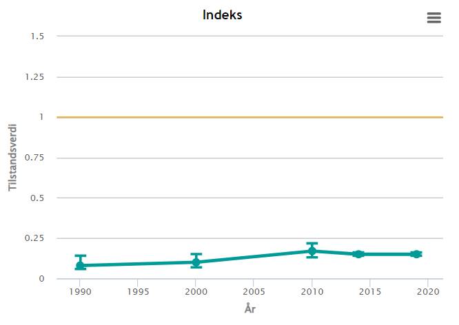
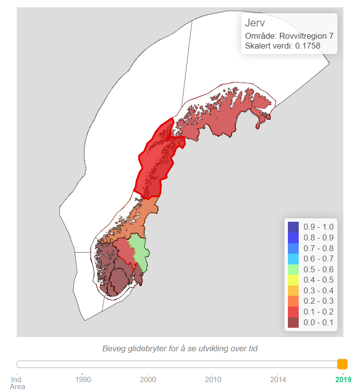
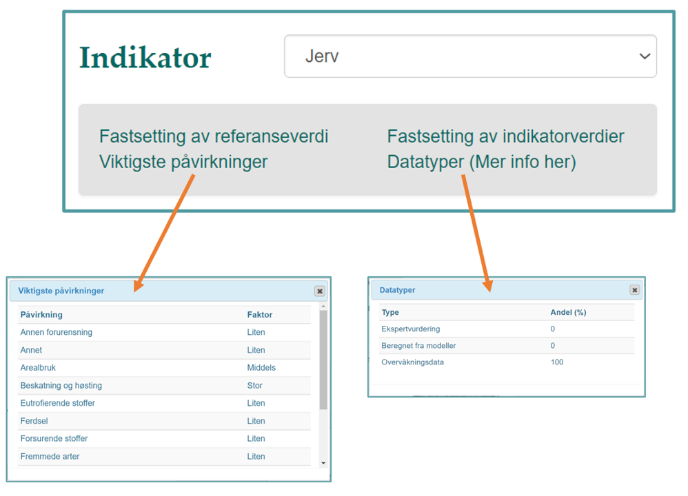

--- 
title: "NIviz"
author: "Chloé Nater, Anders Kolstad, Matthew Grainger, Markus Fjelstad Israelsen"
date: "`r Sys.Date()`"
site: bookdown::bookdown_site
documentclass: book
bibliography: [book.bib, packages.bib]
description: |
  Code and functions for improved visualization of indicator data, thematic indices, and ecosystem indices from the Norwegian Nature Index work.
biblio-style: apalike
csl: chicago-fullnote-bibliography.csl
always_allow_html: yes
---

# Introduction

As part of the Nature Index’ “vedlikeholdsavtale” for 2022, we organized a workshop for mapping out potential improvements for the graphical presentation of the Nature Index on its website (www.naturindeks.no) and developing suggestions and prototypes for new plots, figures, and maps. The following documentation constitutes a report of the work that has been done under this workshop. 
The report is set up as a bookdown document. This means that at the core it consists of Rmarkdown files (.Rmd) that contain written text, raw R code, and figures. Rmarkdown files can be rendered into a variety of formats including HTML and PDF. The former is deployed to a webpage: (https://ninanor.github.io/NIviz/index.html) and provides the best reading experience. The PDF version is suitable for archiving, but the formatting – in particular of code snippets – can be suboptimal in places. 
The work was conducted in an open manner, and all code that was developed is publicly available in a dedicated repository on GitHub: https://github.com/NINAnor/NIviz. 

## Today’s presentation and need for improvements
The website www.naturindeks.no presents the results from the most recent update of the Nature Index. Specifically, it visualizes the calculated values for all individual indicators, for the Nature Index for each ecosystem type, and for a variety of thematic indices as both area-weighted time-series (Figure \@ref(fig:NITrendPlot)) and as maps (Figure \@ref(fig:NIMap)). Additionally, other key information about indicators, such as the importance of disturbance factors and the relative amounts of data from different sources, are displayed as plain text and/or tables (they can be found on the top-right of the indicator pages on www.naturindeks.no, Figure \@ref(fig:NINokkel)).   

### Time series plots
```{r NITrendPlot, out.width = "100%", echo = FALSE, fig.cap = "Area-weighted time-series for wolverine indicator as presented in today's version of the Nature Index webpage."}

```

Today's time series plots show the area-weighted indicator and index values, including uncertainty, over time. 
The representation is well suited for displaying index change over time, but several improvements could be made when used for single indicators: 

1. **Clarifying definition:** today's graphs show the area-weighted averages of indicator values. This means that they do NOT display "how well populations of an indicator species are doing within Norway" but "how well areas within Norway combined are doing with respect to an indicator species". This definition is not intuitive and not clearly stated as of now, which makes it easy for people to misunderstand what they are looking at. 

2. **Displaying raw data:** only the scaled indicator values are shown, but raw data (= un-scaled population estimates stored in the Nature Index database and underlying indicator calculation) is not visible. Omitting raw data is not only in disagreement with principles of transparency, but also a lost opportunity in several ways. Displaying raw data next to scaled indicator data may help people to better understand both, and also showcase what kind of data (including its spatial and temporal resolution) is available and forms the backbone of the indicator calculations. 

3. **Toggle option for different areas:** for both scaled indicator values and underlying raw data, it could be informative to be able to look at time-series from different areas and compare them. That would, for example, be able to show that some species may have declining and increasing trends in different areas, or that trends in population changes may differ in strength across space. 

4. **Review criteria for NOT including time-series plots:** for many indicators, the time-series plots are not displayed on the website at all. Instead, one is greeted with a paragraphs outlining potential scenarios in which the graphs may not be shown. The scenarios include: data only available for a small area, large proportion of missing data, data showing opposing trends in different areas, high uncertainty in trends estimates, and indicator values that have been very good for the entire time series. This has a scent of cherry-picking, and can not be considered transparent or good practice. In many cases, finding appropriate ways to present results and providing good explanations of graphs should be preferable to omitting information and this should be revisited befor publishing NI2025. 

### Maps
```{r NIMap, out.width = "100%", echo = FALSE, fig.cap = "Map of wolverine indicator as presented in today's version of the Nature Index webpage. Note that when hovering over one area, it highlights and a pop-up box appears on the top right displaying the area name and exact average indicator value. The sliding bar on the bottom allows to toggle between years."}

```

Today's maps show the average indicator / index value per area within Norway. The maps have some basic interactive elements: 1) hovering over an area will highlight it and display a pop-up box that shows the area name and exact average indicator values and 2) the sliding bar at the bottom allows to toggle between years. 

The main drawback with the current map solution is that it does not display uncertainty in the indicator / index values at all. Uncertainty visualization is a very active field of research at the moment, not in the least because there is an increasing focus in management and politics on maps of (= spatially explicit information on) biodiversity, ecosystem condition, ecosystem services, etc.
Innovative approaches to visualizing uncertainty in maps are consequently popping up, and it is worth investigating the potential use of at least some of these here. 
Additionally, there are some smaller quality of life improvements that could be made to the current maps. For example, having the option to zoom in would greatly help with visualization of indicators that have data provided at fine spatial scales (e.g. municipality-level: https://www.naturindeks.no/Indicators/dikesoldogg).


### Other key information

```{r NINokkel, out.width = "100%", echo = FALSE, fig.cap = "Display of additional key information on the indicator pages on the website (top right corner)."}

```

There's a range of other key information tied to each indicator and index. Some of it is presented on today's website but could be presented better, and some is not presented on the website at all but maybe should be. 

In the top-right corner of the pages of all indicators is a box with four hyperlinks to different pieces of key information. The first notable thing here is that these links look as if they will take one away from the page when clicking, and are therefore not very inviting to click on. Using a different presentation that is more in line with modern web design could remedy this. 

If one does dare to click on one of the links, a small box with the information will pop up. While text seems appropriate to describe how indicator and reference values are set up, the tables presenting the relative importance of disturbance factors and percentage of data from different sources are bland and not engaging in the least. There are many alternative ways of presenting such information in more inviting ways. 

The same approaches would also work well for displaying some bits of key information that are not included on the webpage yet such as an indicator's ecosystem fidelity (i.e. which ecosystem it belongs/contributes to), the proportion of missing/imputed datapoints in the time-series, and various aspects of weighting (e.g. weights of different indicators in one index, weights of one indicator in different indices, area weights within an indicator, etc.)


## About the suggestions and prototypes developed in this pilot project

The remainder of this documentation contains code for generating and presentation of some preliminary graphs and figures that could potentially address the short-comings of today's presentation outlined above. They should be regarded as drafts or prototypes; they are by no means ready products and implementation would require some further development, including optimisation, proper styling according to a common theme, and -- in some cases -- adaptation of the R code into the source code for the website. We also outline some additional ideas that we were considering, but did not have time to investigate further at this stage. 

The majority of graphs were developed for raw data and/or scaled values of a selection of single-species indicators. The indicators used in the pilot study were selected to represent both terrestrial and aquatic habitats, and to cover different spatial resolutions and degrees of uncertainty:

- Oblong-leaved sundew ("Dikesoldogg")
- Wolverine ("Jerv")
- Moose ("Elg)
- Common guillemot ("Lomvi")
- White-tailed eagle ("Havørn")
- Common ling ("Lange")

Nonetheless, most of the graphs developed for indicator data are perfectly applicable also to the presentation of composite indices (Nature Index, various thematic indices, etc.). Similarly, the graphical tools suggested here are just as relevant to the "Fagsystem for økologisk tilstand" as they are to the Nature Index. 

Both the code and documentation for this pilot project are collaborative work and were written by different people (Chloé Nater, Anders Kolstad, Matthew Grainger, Markus Fjelstad Israelsen). For that reason, writing style, coding style, and relative amounts of full-text explanations are variable throughout this document. We are happy to provide additional information on any section on request.  


